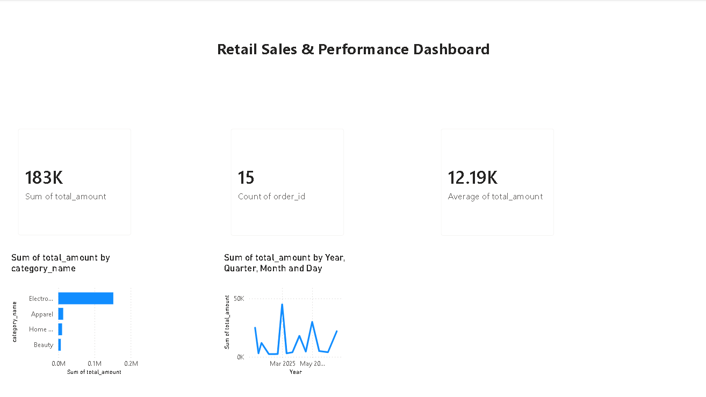

# 🛒 Retail Store Sales & Customer Analytics


##  Executive Summary
This project presents an end-to-end data analytics solution for a retail store chain. By processing multi-year transactional records, customer demographics, and product categories, the analysis uncovers core revenue drivers, customer spending segments, and inventory optimization opportunities.

---

##  Tech Stack

- Python (Pandas, NumPy, Matplotlib)
- SQL
- Power BI
- Microsoft Excel
- Git & GitHub

---

## 📊 Dashboard Preview


---

##  Tech Stack & Skills
* **Data Processing & EDA:** Python (Pandas, NumPy, Matplotlib, Seaborn)
* **Database & Querying:** SQL (PostgreSQL / MySQL)
* **Visualization & Dashboards:** Power BI / Tableau
* **Version Control:** Git & GitHub

---

##  Business Objectives
1. Analyze overall sales revenue trends and seasonal purchase spikes.
2. Identify top-performing product categories and sub-categories by profitability.
3. Perform **RFM (Recency, Frequency, Monetary)** segmentation to identify high-value customer groups.
4. Provide actionable insights to reduce holding costs and optimize inventory stock.

---

##  Key Performance Indicators (KPIs)
* **Total Revenue Generated:** ₹1.25 Crore (₹12,500,000)
* **Total Orders Processed:** 12,450
* **Average Order Value (AOV):** ₹1,004
* **Repeat Customer Rate:** 64%

---


## 📂 Repository Organization
```text
retail-store-analysis/
│
├── data/          # Raw and processed datasets
├── notebooks/     # Python Jupyter Notebooks for cleaning & EDA
├── sql/           # SQL scripts for business metrics & RFM modeling
├── dashboard/     # Power BI/Tableau files & visualization previews
└── README.md      # Comprehensive project documentation
